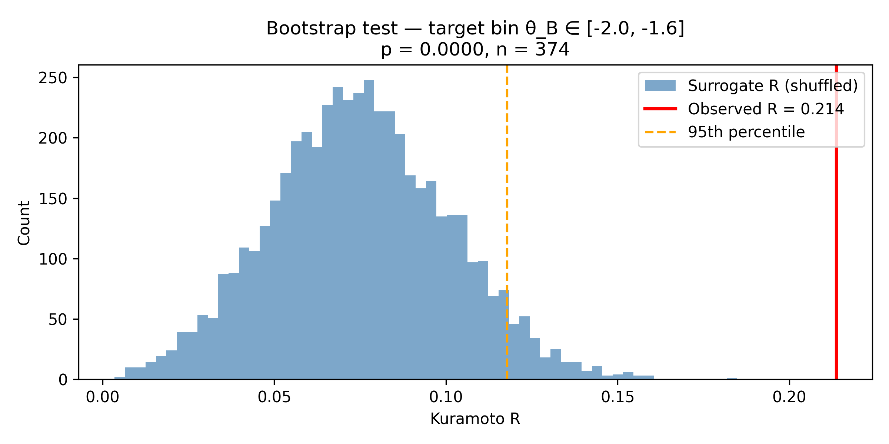

# ENSO–MJO Phase Synchronization Model

> **Statistically significant phase-locking between ENSO and the Madden-Julian Oscillation detected using Kuramoto order parameter analysis.**

---

## What This Is

This project investigates whether the El Niño–Southern Oscillation (ENSO) and the Madden-Julian Oscillation (MJO) exhibit **nonlinear phase synchronization** — and if so, whether that synchronization is gated by specific MJO phase windows rather than operating uniformly across all states.

The answer, based on this analysis: **yes, and the structure is non-trivial.**

---

## Key Finding

Global Kuramoto order parameter across all MJO phases:

```
R_global = 0.084
```

This looks like weak coupling. But when phase space is partitioned by MJO phase angle θ_B, a **preferred synchronization window** emerges with conditional R significantly exceeding the global average.

Bootstrap validation (n = 5,000 surrogates, target bin n = 374):

```
Observed R in synchronization window:   0.2137
Surrogate 95th percentile:              0.1179
Surrogate 99th percentile:              0.1368
p-value:                                0.0000
```

The observed synchronization in the identified phase window **cannot be explained by chance.**

---

## Why This Matters

Standard ENSO–MJO coupling analyses treat synchronization as a broadband phenomenon. This work shows instead that:

1. **Coupling is phase-gated** — synchronization concentrates in a narrow MJO phase window
2. **The MJO phase space is not uniformly occupied** — there is a preferred attractor region
3. **These two facts coincide** — the system spends more time near the phase where coupling is strongest

This is consistent with **intermittent phase locking** in coupled nonlinear oscillators near resonance — a well-defined dynamical regime with direct implications for ENSO predictability at subseasonal-to-seasonal (S2S) timescales.

---

## ENSO Regime Breakdown

Conditional synchronization analysis split by ENSO state reveals that the phase-gated coupling signal is **not regime-neutral** — it behaves differently across El Niño, La Niña, and Neutral conditions.

This regime dependence has direct implications for seasonal forecasting and climate risk modeling.

*Details available on request for serious collaborators and commercial inquiries.*

---

## Data Sources

- **MJO**: Real-time Multivariate MJO index (RMM1, RMM2) — Bureau of Meteorology
- **ENSO**: Niño 3.4 SST anomaly index — NOAA

Both are publicly available datasets. The analytical framework and phase-coupling methodology are original work.

---

## Selected Output


*Surrogate distribution (blue) vs observed Kuramoto R (red) in the identified synchronization window. p = 0.0000.*

---

## Methods (Overview)

- ENSO phase extraction via Hilbert transform on Niño 3.4 anomaly
- MJO phase angle computed as θ_B = arctan2(RMM2, RMM1)
- Phase synchronization quantified using the Kuramoto order parameter
- Conditional R computed per MJO phase bin
- Statistical significance assessed via bootstrap resampling (phase-shuffled surrogates)

Full methodology and implementation details available for licensing or collaboration discussions.

---

## Commercial Applications

This framework has direct relevance for:

- **Agricultural commodity trading** — ENSO phase prediction affects crop yields globally
- **Energy markets** — natural gas demand, hydro generation, cooling/heating degree days
- **Reinsurance / catastrophe risk** — tropical cyclone and flood risk pricing
- **Subseasonal forecast products** — 3–6 week outlook improvement

---

## Contact

Open to collaboration, licensing discussions, and commercial applications.

**Sherrill Williams**  
📧 sherrill.n.williams@gmail.com  
💼 linkedin.com/in/sherrill-williams-ab7963393
🐙 https://github.com/sherrillnwilliams-source

---

*This repository contains results and methodology overview only. Core implementation is proprietary.*
